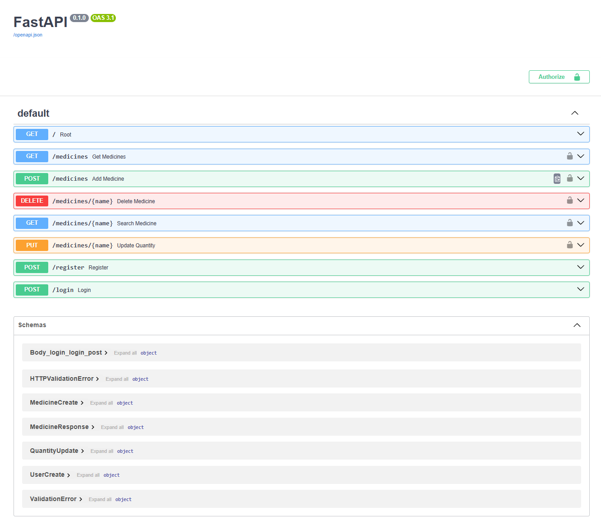
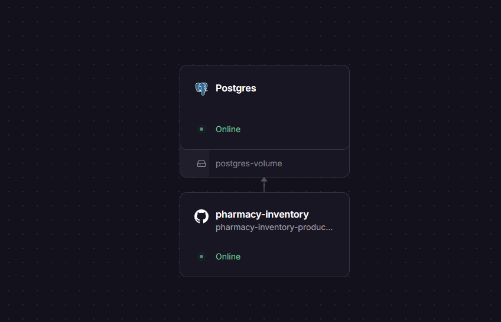
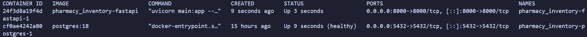
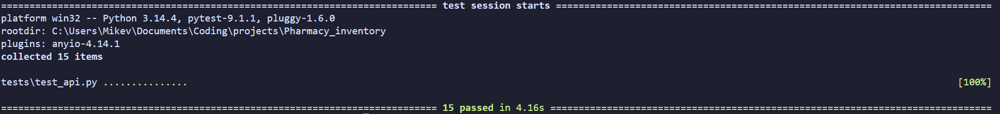

# Pharmacy Inventory API

## Description

A production-ready RESTful Pharmacy Inventory API built with FastAPI,
PostgreSQL, SQLAlchemy, Docker, JWT authentication, and deployed on
Railway with a managed cloud PostgreSQL database.

The application allows users to register, authenticate, and securely
manage pharmacy inventory through protected REST endpoints with full
CRUD functionality, request validation, interactive API documentation,
persistent PostgreSQL storage, and automated integration testing.

------------------------------------------------------------------------

## Live Demo

-   **Live API:**
    https://pharmacy-inventory-production-752a.up.railway.app
-   **Swagger Documentation:**
    https://pharmacy-inventory-production-752a.up.railway.app/docs

------------------------------------------------------------------------

## Screenshots

### Swagger API Documentation

Interactive FastAPI documentation generated automatically by Swagger UI.



------------------------------------------------------------------------

### Railway Deployment

Production deployment on Railway using a managed PostgreSQL database.



------------------------------------------------------------------------

### Docker Compose

FastAPI and PostgreSQL running locally with Docker Compose.



------------------------------------------------------------------------

### Automated Integration Tests

All 15 automated integration tests passing successfully.



------------------------------------------------------------------------

## Features

-   User registration
-   Secure login with JWT authentication
-   Password hashing with bcrypt
-   Protected medicine endpoints
-   View all medicines
-   Search for a medicine by name (case-insensitive)
-   Add new medicines
-   Update medicine quantity
-   Delete medicines
-   Prevent duplicate NDC numbers
-   Automatic request validation with Pydantic
-   Response models for consistent API responses
-   Proper HTTP status codes (201, 401, 404, 409, etc.)
-   Interactive Swagger API documentation (`/docs`)
-   Automated integration testing with pytest
-   Dockerized FastAPI application
-   Multi-container architecture with Docker Compose
-   Persistent PostgreSQL storage using Docker volumes
-   PostgreSQL health checks
-   Cloud deployment with Railway

------------------------------------------------------------------------

## Technologies Used

-   Python
-   FastAPI
-   PostgreSQL
-   SQLAlchemy
-   Psycopg
-   Pydantic
-   python-jose (JWT)
-   Passlib (bcrypt)
-   Uvicorn
-   Pytest
-   Docker
-   Docker Compose
-   Railway
-   Git
-   GitHub

------------------------------------------------------------------------

## API Endpoints

  -----------------------------------------------------------------------
  Method             Endpoint               Description
  ------------------ ---------------------- -----------------------------
  POST               `/register`            Register a new user

  POST               `/login`               Authenticate a user and
                                            receive a JWT

  GET                `/medicines`           Retrieve all medicines
                                            *(Requires authentication)*

  GET                `/medicines/{name}`    Retrieve a medicine by name
                                            *(Requires authentication)*

  POST               `/medicines`           Add a new medicine *(Requires
                                            authentication)*

  PUT                `/medicines/{name}`    Update a medicine's quantity
                                            *(Requires authentication)*

  DELETE             `/medicines/{name}`    Delete a medicine *(Requires
                                            authentication)*
  -----------------------------------------------------------------------

------------------------------------------------------------------------

# Running the Application

## Option 1 (Recommended): Docker

### 1. Clone the repository

``` bash
git clone https://github.com/versionMichael/pharmacy-inventory.git
cd pharmacy-inventory
```

### 2. Create environment files

Create the following files using the provided templates:

``` text
.env
.env.docker
```

using:

``` text
.env.example
.env.docker.example
```

### 3. Start the application

``` bash
docker compose up --build
```

### 4. Open the API documentation

    http://localhost:8000/docs

------------------------------------------------------------------------

## Option 2: Local Development

### 1. Clone the repository

``` bash
git clone https://github.com/versionMichael/pharmacy-inventory.git
cd pharmacy-inventory
```

### 2. Install dependencies

``` bash
pip install -r requirements.txt
```

### 3. Create a PostgreSQL database

    pharmacy_inventory

### 4. Create a `.env` file

Use `.env.example` as a template and update the database credentials.

### 5. Start the FastAPI server

``` bash
python -m uvicorn main:app --reload
```

### 6. Open the API documentation

    http://127.0.0.1:8000/docs

------------------------------------------------------------------------

## Running Tests

Run the complete integration test suite:

``` bash
python -m pytest
```

The project includes **15 automated integration tests** covering:

-   User registration
-   User authentication
-   Protected endpoints
-   CRUD operations
-   Duplicate validation
-   Error handling

------------------------------------------------------------------------

## Docker

This project uses Docker Compose to run both the FastAPI application and
PostgreSQL database.

Start the application with:

``` bash
docker compose up --build
```

The API will be available at:

    http://localhost:8000/docs

The PostgreSQL database uses a **named Docker volume**, allowing data to
persist between container restarts.

------------------------------------------------------------------------

## Architecture

-   FastAPI provides the REST API.
-   SQLAlchemy manages database interactions.
-   PostgreSQL stores persistent application data.
-   JWT authentication secures protected endpoints.
-   Docker containerizes the application.
-   Docker Compose orchestrates the FastAPI application and PostgreSQL
    database for local development.
-   Railway hosts the production application and managed PostgreSQL
    database.

------------------------------------------------------------------------

## Project Structure

``` text
pharmacy-inventory/
│
├── screenshots/
│   ├── dockerps.png
│   ├── fastapi_docs.png
│   ├── railway.png
│   └── tests.png
├── tests/
│   └── test_api.py
├── Dockerfile
├── docker-compose.yml
├── .dockerignore
├── .env.example
├── .env.docker.example
├── auth.py
├── database.py
├── main.py
├── models.py
├── requirements.txt
├── README.md
└── .gitignore
```

------------------------------------------------------------------------

## Roadmap Progress

### ✅ Completed

-   [x] Build command-line pharmacy inventory application
-   [x] Replace text file storage with SQLite
-   [x] Convert application to a FastAPI REST API
-   [x] Implement CRUD API endpoints
-   [x] Add request validation with Pydantic
-   [x] Add response models
-   [x] Return proper HTTP status codes
-   [x] Migrate from SQLite to PostgreSQL
-   [x] Refactor raw SQL to SQLAlchemy ORM
-   [x] Implement case-insensitive medicine searches
-   [x] Implement JWT authentication and protected endpoints
-   [x] Automated integration testing with pytest
-   [x] Environment variables (.env)
-   [x] Docker
-   [x] Docker Compose
-   [x] Persistent Docker volumes
-   [x] PostgreSQL health checks
-   [x] Cloud deployment with Railway
